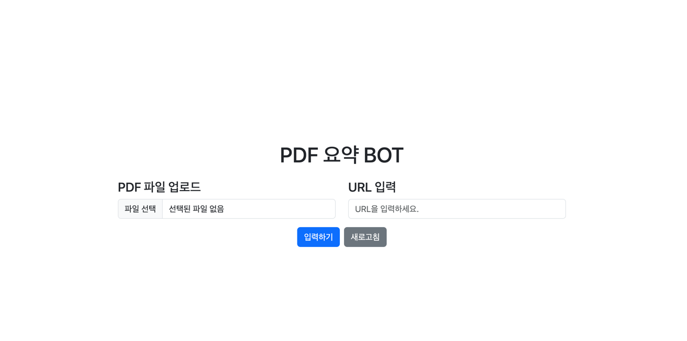
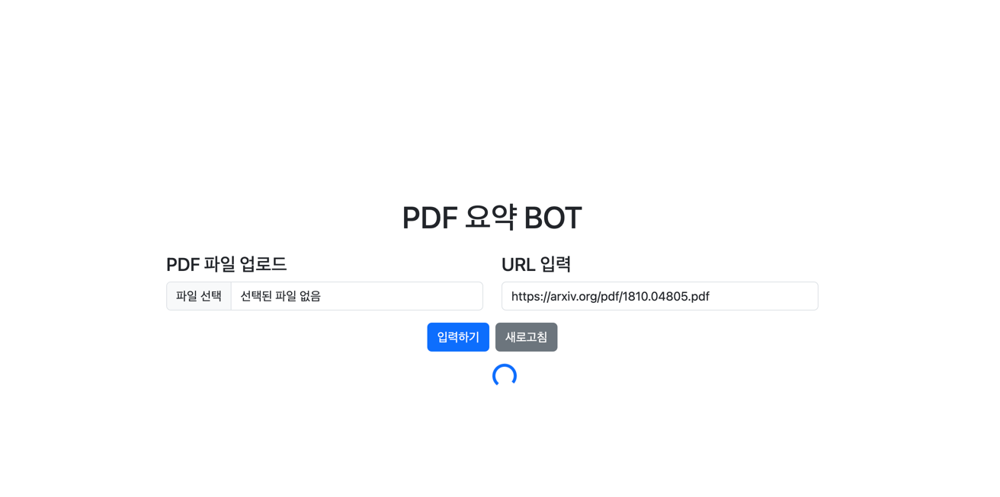
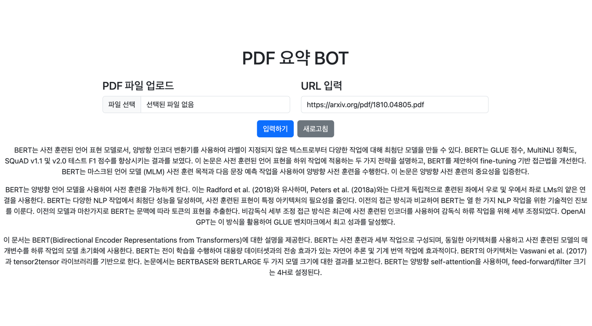

# langchain-summarize-bot

##
Langchain을 활용하여, PDF를 요약하는 봇 입니다.
- 논문을 주로 읽기 위해서 만들었습니다.
- pdf 파일이거나, pdf 링크 주소를 넣으면 동작합니다.

## Getting started
- docker-compose 파일에서 OPENAI_API_KEY 부분을 본인의 API 키로 설정해야 합니다.
- Split Page 수를 지정해야 합니다. default는 5페이지씩 분할하여, 요약합니다.
- MODEL_NAME을 설정하여, GPT4를 사용할 수 있습니다. default = gpt-3.5-turbo , gpt4 사용 방법 gpt-4


- 실행 방법 -> 
```Docker-compose up -d```

- 접속 방법 ->
```http://localhost:8989```

## 메인 화면


## 실행 화면

